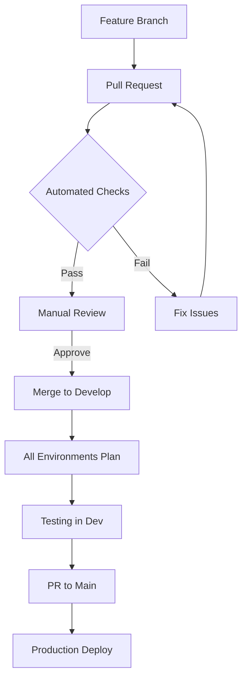

# Deployment Guide and Release Lifecycle

## Overview

This repository implements a GitOps-based deployment model for Azure infrastructure using Terraform and GitHub Actions with a DRY (Don't Repeat Yourself) approach.

## DRY Architecture

### Shared Configuration Structure
- **Single Terraform codebase** at root level with environment-specific variables
- **Environment configurations** in `environments/[env]/` containing only:
  - `backend.tf` - Backend state configuration
  - `terraform.tfvars` - Environment-specific non-sensitive values
- **No duplicate Terraform files** across environments
- **Environment selection** via Terraform variables

### Benefits
1. **Maintainability**: Update infrastructure in one place
2. **Consistency**: Guaranteed identical infrastructure logic
3. **Reduced Errors**: No drift between environment configurations
4. **Simplified Reviews**: Changes are clear and in one location

## Release Lifecycle

### 1. Development Phase
- Create feature branch from `develop`
- Make infrastructure changes in root Terraform files
- Test locally using: `make plan ENVIRONMENT=dev`
- Submit pull request to `develop`

### 2. Pull Request Review
- Automated checks run:
  - Terraform format validation
  - Terraform validation
  - TFLint analysis
  - Security scanning with Checkov
  - Terraform plan generation for both environments
- Manual review by team
- Merge to `develop` after approval

### 3. Staging/Testing
- Changes in `develop` branch trigger plan-only runs
- Review generated plans for all environments
- Test in dev environment first

### 4. Production Release
- Create PR from `develop` to `main`
- Review consolidated changes
- Merge triggers automatic deployment to selected environment

### 5. Manual Deployment (Optional)
- Use workflow dispatch for manual deployments
- Select target environment (dev/prod)
- Useful for emergency fixes or specific deployments

## Environment Strategy

### Why Resource Groups over Subscriptions?

We use Resource Groups to separate environments for the following reasons:

1. **Cost Efficiency**: Single subscription simplifies billing and cost management
2. **Simplified Access Control**: Easier to manage RBAC at resource group level
3. **Network Connectivity**: Easier VNet peering and connectivity between environments
4. **Shared Resources**: Common resources (like container registries) can be shared
5. **Smaller Teams**: More suitable for small to medium teams

For larger enterprises, separate subscriptions provide:
- Complete isolation
- Independent billing
- Separate service limits
- Enhanced security boundaries

## Security Considerations

### SSH Key Management
- VM access uses SSH keys instead of passwords
- SSH keys are generated dynamically in CI/CD pipeline
- For local development, use your existing SSH key: `~/.ssh/id_rsa.pub`
- No passwords stored in tfvars files

### Secrets Management
- All sensitive values managed through:
  - GitHub Secrets for CI/CD
  - Environment variables for local development
  - Azure Key Vault for runtime secrets (future enhancement)

## GitHub Actions Secrets Required

Configure these secrets in your GitHub repository:

- `ARM_CLIENT_ID`: Azure Service Principal Application ID
- `ARM_CLIENT_SECRET`: Azure Service Principal Secret
- `ARM_SUBSCRIPTION_ID`: Azure Subscription ID
- `ARM_TENANT_ID`: Azure Active Directory Tenant ID

## Local Development

1. **Setup SSH Key** (if not already present):
   ```bash
   ssh-keygen -t rsa -b 4096 -f ~/.ssh/id_rsa
   ```

2. **Initialize Terraform** for your environment:
   ```bash
   make init ENVIRONMENT=dev
   ```

3. **Plan changes**:
   ```bash
   make plan ENVIRONMENT=dev
   ```

4. **Apply changes**:
   ```bash
   make apply ENVIRONMENT=dev
   ```

5. **Switch environments**:
   ```bash
   make plan ENVIRONMENT=prod
   make apply ENVIRONMENT=prod
   ```

## Deployment Commands

```bash
# Development environment
make init ENVIRONMENT=dev
make plan ENVIRONMENT=dev
make apply ENVIRONMENT=dev

# Production environment
make init ENVIRONMENT=prod
make plan ENVIRONMENT=prod
make apply ENVIRONMENT=prod

# Other useful commands
make fmt              # Format all Terraform files
make validate         # Validate Terraform configuration
make lint            # Run TFLint
make security-scan   # Run Checkov security scan
make docs            # Generate module documentation
```

## Deployment Workflow



## Best Practices

1. **Never commit sensitive data** - Use GitHub Secrets or environment variables
2. **Always run plan before apply** - Review changes carefully
3. **Use PR reviews** - Four eyes principle
4. **Tag releases** - Track deployed versions
5. **Monitor costs** - Set up Azure Cost Alerts
6. **Keep environments in sync** - Deploy to dev first, then prod

## Rollback Procedure

1. Revert the merge commit in `main` branch
2. GitHub Actions will automatically trigger
3. Terraform will plan the rollback
4. Review and approve the rollback deployment

## Emergency Procedures

For urgent fixes:
1. Create hotfix branch from `main`
2. Make minimal required changes
3. Create PR directly to `main`
4. Use emergency approval process
5. Deploy using manual workflow trigger

## Adding New Environments

1. Create new directory: `mkdir -p environments/staging`
2. Create backend configuration:
   ```hcl
   # environments/staging/backend.tf
   terraform {
     backend "azurerm" {
       key = "staging/terraform.tfstate"
     }
   }
   ```
3. Create tfvars file:
   ```hcl
   # environments/staging/terraform.tfvars
   environment = "staging"
   admin_username = "azureuser"
   tags = {
     Project = "Opella"
     Team    = "DevOps"
   }
   ```
4. Add environment configuration to `main.tf` locals
5. Update GitHub Actions workflow to include new environment